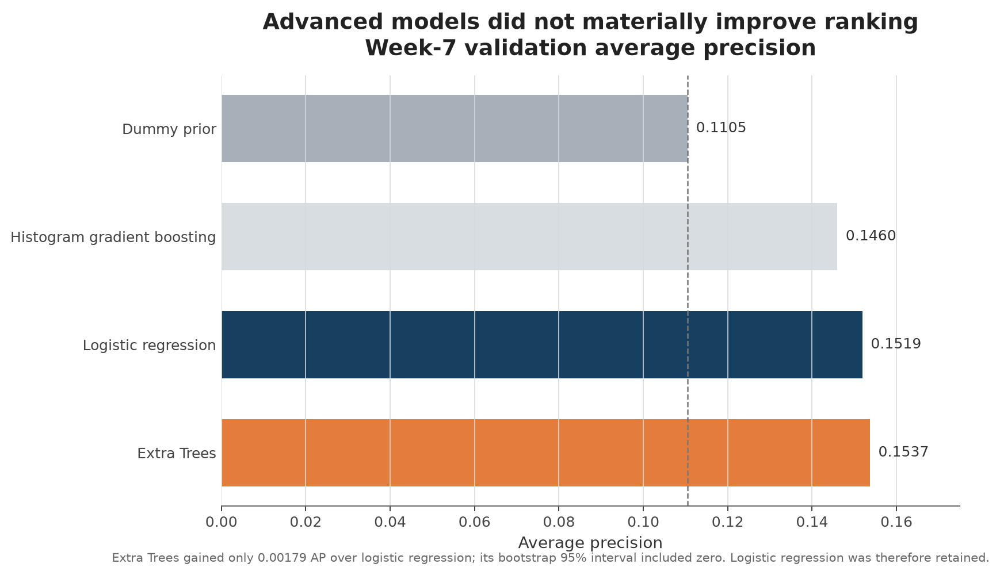
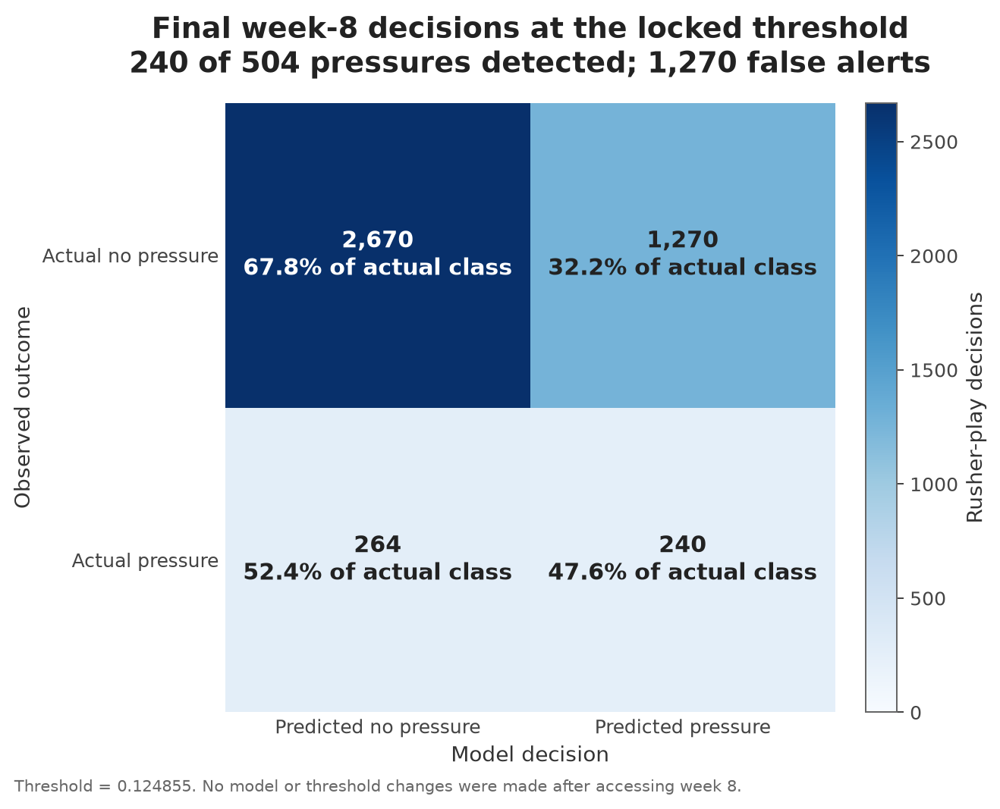
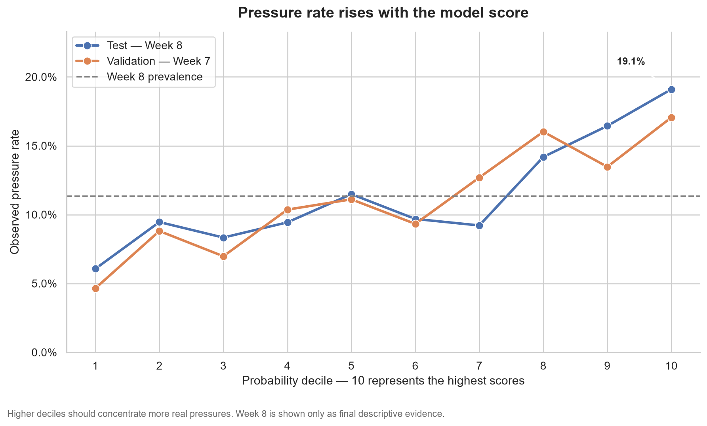
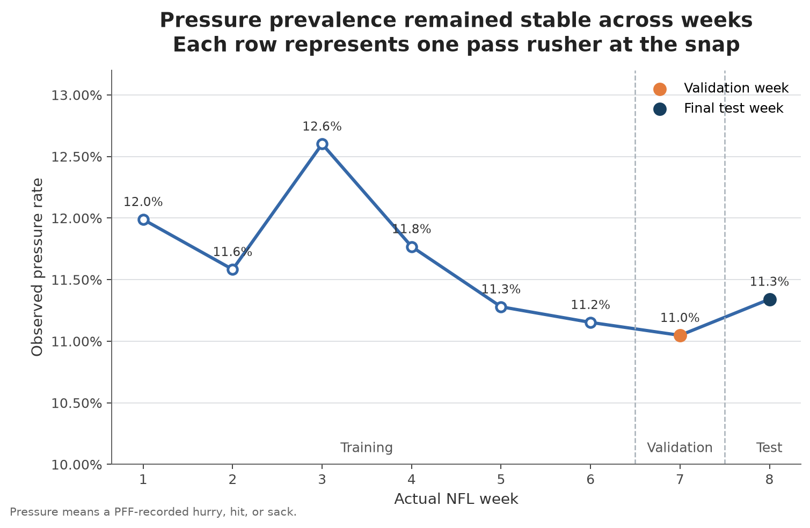

# Predicción de presión del pass rush en el momento del snap

[English](README.md) | [Español](README.es.md)

Proyecto de Machine Learning con control de leakage que estima, en el momento del snap, la probabilidad de que un pass rusher de la NFL genere posteriormente presión sobre el quarterback.

El proyecto fue desarrollado como una evaluación técnica profesional para una posición de Data Scientist. Da prioridad a la validación temporal, reproducibilidad, selección honesta del modelo, interpretación de resultados y separación estricta entre el desarrollo y la evaluación final.

Para consultar toda la metodología y evidencia, lee el [reporte técnico en español](reports/technical_report_es.md).

## Resumen ejecutivo

La tabla analítica contiene 36,259 observaciones de pass rushers correspondientes a 8,531 jugadas de las semanas 1–8 de la NFL. Se produjo una presión en 4,214 observaciones, lo que representa una prevalencia general de 11.621942%.

Cada fila representa un pass rusher dentro de una jugada y se identifica de manera única mediante:

```text
gameId + playId + nflId
```

La variable objetivo binaria es:

```text
pressure = pff_hurry OR pff_hit OR pff_sack
```

Solamente se permitieron como inputs los datos disponibles en el snap. Se excluyeron de los predictores los movimientos posteriores al snap, resultados de la jugada, resultados del bloqueo y campos de resultados PFF.

Se seleccionó un pipeline regularizado de `LogisticRegression` sin balanceo artificial de clases. Aunque Extra Trees obtuvo un Average precision ligeramente mayor en validación, la mejora fue solamente de 0.001790 y su intervalo bootstrap de 95%, `[-0.011327, 0.014929]`, incluyó cero. Se conservó el modelo logístico porque su desempeño fue estadísticamente equivalente y ofrece una solución más sencilla e interpretable.

En el conjunto test intacto de la semana 8, el modelo final obtuvo:

- Average precision: 0.15775008696279033
- ROC-AUC: 0.5968898557731045
- F1: 0.23833167825223436
- Recall: 0.47619047619047616
- Precision: 0.15894039735099338

El modelo es útil para ranking y priorización, pero su discriminación absoluta es modesta y produce muchos falsos positivos. No debe presentarse como un detector autónomo de presión con alta confianza.

## Conceptos de futbol americano

- **Quarterback:** jugador ofensivo que normalmente recibe el balón e intenta realizar el pase.
- **Pass rusher:** defensor cuya tarea es alcanzar o incomodar al quarterback.
- **Snap:** instante en que inicia la jugada y se entrega el balón al quarterback.
- **Hurry:** presión que obliga al quarterback a actuar antes o con menor comodidad.
- **Hit:** contacto con el quarterback asociado con el pass rush.
- **Sack:** el quarterback es derribado detrás de la línea de scrimmage antes de completar un pase.
- **Pressure:** en este proyecto, cualquier PFF hurry, hit o sack.

La unidad de predicción es un pass rusher dentro de una jugada. Una jugada se cuenta de manera única mediante `gameId + playId`; `playId` por sí solo no es globalmente único.

## Datos

El proyecto utiliza datos públicos de player tracking de la NFL, scouting de PFF e información de equipos disponibles en [Kaggle](https://www.kaggle.com/datasets/dmay01/usefuldata).

Cantidades principales validadas:

| Elemento | Valor |
|---|---:|
| Filas de tracking bruto | 8,314,178 |
| Columnas de tracking bruto | 16 |
| Registros jugador-jugada de PFF | 188,254 |
| Jugadas fuente | 8,557 |
| Jugadas con snap manual válido | 8,532 |
| Filas analíticas finales | 36,259 |
| Jugadas analíticas finales | 8,531 |
| Presiones positivas | 4,214 |
| Tasa general de presión | 11.621942% |
| Predictores aprobados | 51 |
| Valores faltantes o no finitos | 0 |

Los archivos físicos de tracking no correspondían individualmente con las semanas reales de la NFL. Por esta razón, `actual_week` se derivó de la fecha de cada partido y no del nombre del archivo Parquet.

## Diseño analítico

El modelo utiliza 51 predictores aprobados:

- 50 predictores numéricos.
- Un predictor categórico: `rusher_position_lined_up`.

Las variables describen la geometría y el movimiento disponibles en el snap, incluyendo distancia entre pass rusher y quarterback, espacios relativos, profundidad del quarterback, relación con el bloqueador más cercano, coordenadas normalizadas, velocidades y componentes direccionales.

Las variables numéricas se estandarizan. La posición categórica se procesa mediante one-hot encoding y `handle_unknown="ignore"`.

Se excluyen identificadores, componentes del target, información posterior al snap, resultados, campos de blocking result, campos exclusivos de auditoría y variables que pudieran revelar información futura.

## Diseño de evaluación temporal

Se utilizó una separación temporal en lugar de una división aleatoria para representar mejor la aplicación del modelo sobre partidos futuros.

| Propósito | Semanas | Filas | Jugadas | Positivos | Tasa de presión |
|---|---:|---:|---:|---:|---:|
| Training inicial | 1–6 | 27,950 | 6,587 | 3,283 | 11.745975% |
| Validation y selección del threshold | 7 | 3,865 | 913 | 427 | 11.047865% |
| Test final intacto | 8 | 4,444 | 1,031 | 504 | 11.341134% |
| Dataset completo | 1–8 | 36,259 | 8,531 | 4,214 | 11.621942% |

La semana 8 permaneció sellada durante la preparación de datos, selección de variables, comparación de modelos, evaluación de hiperparámetros y selección del threshold. Se abrió una sola vez para inferencia final después de bloquear la política completa.

## Metodología

1. Validar inventario, schemas, llaves, eventos de snap y cobertura semanal.
2. Construir el target de presión con las etiquetas PFF hurry, hit y sack.
3. Construir una fila analítica por cada pass rusher elegible en el snap.
4. Eliminar identificadores, información futura, resultados y variables con riesgo de leakage.
5. Realizar EDA sin acceder a la semana 8.
6. Comparar modelos logísticos baseline en la semana 7.
7. Evaluar Extra Trees y HistGradientBoosting mediante temporal cross-validation.
8. Seleccionar el modelo considerando desempeño, incertidumbre, simplicidad e interpretabilidad.
9. Seleccionar el threshold operativo exclusivamente en la semana 7.
10. Bloquear modelo, orden de variables y threshold mediante evidencia SHA-256.
11. Entrenar el pipeline seleccionado una vez sobre las semanas 1–7.
12. Evaluar una sola vez sobre la semana 8 intacta sin ajustes post-test.

## Selección del modelo

### Baselines

| Modelo | Average precision de validation | ROC-AUC | Log loss |
|---|---:|---:|---:|
| Dummy prior | 0.110479 | 0.500000 | 0.347754 |
| `LogisticRegression_unweighted` | 0.151899 | 0.600006 | 0.342382 |
| `LogisticRegression_balanced` | 0.151749 | 0.601697 | 0.675077 |

### Candidatos avanzados

| Modelo | Average precision de validation | ROC-AUC | Log loss | Temporal-CV mean AP |
|---|---:|---:|---:|---:|
| Extra Trees | 0.153689 | 0.602314 | 0.341647 | 0.155191 |
| Logistic regression | 0.151899 | 0.600006 | 0.342382 | 0.154996 |
| HistGradientBoosting | 0.145960 | 0.595577 | 0.343728 | 0.150105 |

El modelo seleccionado es `LogisticRegression_unweighted` con:

```text
C=1.0
solver=lbfgs
max_iter=2000
random_state=42
class_weight=None
```

La pequeña ventaja de Extra Trees no fue estable bajo bootstrap resampling. Por ello, el pipeline logístico ofreció el mejor balance entre desempeño, transparencia y simplicidad operativa.



## Threshold de decisión bloqueado

El threshold de probabilidad se seleccionó maximizando F1 en la semana 7. En caso de empate, se elegiría el threshold más alto.

```text
Locked threshold = 0.12485514806532311
```

Desempeño de validation con este threshold:

| Métrica | Valor |
|---|---:|
| TN | 2,259 |
| FP | 1,179 |
| FN | 211 |
| TP | 216 |
| Precision | 0.154839 |
| Recall | 0.505855 |
| F1 | 0.237102 |
| Specificity | 0.657068 |
| Predicted-positive rate | 0.360931 |

Un threshold convencional de 0.5 no produjo predicciones positivas porque la probabilidad máxima de validation fue aproximadamente 0.4499. El threshold elegido refleja la distribución de probabilidades y el objetivo F1; no representa una regla universal de futbol americano.

## Resultados finales de test

Después de bloquear el modelo y el threshold, el pipeline se entrenó exactamente una vez con las semanas 1–7, utilizando 31,815 filas y 3,710 observaciones positivas. Ninguna fila de la semana 8 participó en el fit.

| Métrica | Resultado en semana 8 intacta |
|---|---:|
| Average precision | 0.15775008696279033 |
| ROC-AUC | 0.5968898557731045 |
| Log loss | 0.34781248418273736 |
| Precision | 0.15894039735099338 |
| Recall | 0.47619047619047616 |
| F1 | 0.23833167825223436 |
| Specificity | 0.6776649746192893 |
| Predicted-positive rate | 0.3397839783978398 |
| Actual-positive rate | 0.11341134113411341 |

Matriz de confusión final:

| Real / predicción | Sin presión | Presión |
|---|---:|---:|
| Sin presión | TN = 2,670 | FP = 1,270 |
| Presión | FN = 264 | TP = 240 |



El F1 final fue ligeramente mayor que el F1 de validation, mientras que Average precision y ROC-AUC permanecieron en rangos similares. Esto respalda una generalización temporal estable, aunque la discriminación general continúa siendo modesta.

## Ranking y calibración

Evidencia adicional de la semana 8:

| Diagnóstico | Valor |
|---|---:|
| Mean predicted probability | 0.115319 |
| Actual pressure rate | 0.11341134113411341 |
| Brier score | 0.099395 |
| Top-decile pressure rate | 19.101% |
| Top-decile lift | 1.684234 |
| AP lift sobre prevalencia | 1.391× |

El 10% de observaciones con mayor score presentó presión con una frecuencia considerablemente superior a la población completa. Este es el uso práctico más sólido del modelo: ordenar observaciones para revisión de analistas, estudio de video o priorización.



## Estabilidad exploratoria

La prevalencia de presión fue relativamente estable durante las ocho semanas. Esto respalda la comparación temporal y conserva una evaluación realista sobre un periodo futuro.



## Interpretación

El modelo final captura una señal real pero limitada a partir de la geometría y movimiento observables en el snap.

Usos apropiados:

- Ordenar observaciones de pass rushers por probabilidad estimada de presión.
- Priorizar jugadas para revisión de analistas o coaches.
- Apoyar análisis exploratorios de futbol americano.
- Servir como baseline interpretable para investigación futura.

Usos no apropiados:

- Tratar cada clasificación positiva como una presión futura confirmada.
- Reemplazar la revisión de video o el conocimiento experto.
- Afirmar efectos causales a partir de los coeficientes.
- Presentar el sistema como detector autónomo de alta confianza.

El threshold favorece Recall sobre Precision. Identifica 240 de las 504 presiones verdaderas, pero también marca 1,270 observaciones sin presión. Esta relación debe considerarse en cualquier aplicación operativa.

## Estructura del repositorio

```text
nfl-pressure-prediction/
├── data/
│   ├── raw/
│   ├── interim/
│   └── processed/
├── models/
├── notebooks/
│   ├── 01_data_validation.ipynb
│   ├── 02_analytical_table.ipynb
│   ├── 03_exploratory_analysis.ipynb
│   ├── 04_modeling_baselines.ipynb
│   ├── 05_advanced_modeling.ipynb
│   ├── 06_threshold_selection.ipynb
│   └── 07_final_evaluation.ipynb
├── reports/
├── src/
│   └── nfl_pressure/
├── README.md
├── README.es.md
└── requirements.txt
```

Los archivos grandes de datos brutos y generados se excluyen de Git cuando corresponde.

## Instalación

El entorno validado utiliza Python 3.14.0.

```powershell
py -3.14 -m venv .venv
.\.venv\Scripts\Activate.ps1
python -m pip install --upgrade pip
python -m pip install -r requirements.txt
python -m ipykernel install --user --name nfl-pressure --display-name "Python (nfl-pressure)"
```

Descarga el dataset fuente desde Kaggle y coloca los archivos originales dentro de `data/raw/` sin cambiar sus nombres.

## Reproducción

Ejecuta los notebooks en orden numérico:

| Notebook | Propósito |
|---|---|
| [01_data_validation.ipynb](notebooks/01_data_validation.ipynb) | Validación de datos brutos y definición del target |
| [02_analytical_table.ipynb](notebooks/02_analytical_table.ipynb) | Construcción de la tabla analítica en el snap |
| [03_exploratory_analysis.ipynb](notebooks/03_exploratory_analysis.ipynb) | Análisis exploratorio sin leakage |
| [04_modeling_baselines.ipynb](notebooks/04_modeling_baselines.ipynb) | Modelos baseline y selección inicial |
| [05_advanced_modeling.ipynb](notebooks/05_advanced_modeling.ipynb) | Candidatos avanzados y temporal CV |
| [06_threshold_selection.ipynb](notebooks/06_threshold_selection.ipynb) | Selección del threshold solo con validation |
| [07_final_evaluation.ipynb](notebooks/07_final_evaluation.ipynb) | Evaluación final bloqueada sobre semana 8 |

Los notebooks incluyen outputs ejecutados, controles de calidad y validaciones de artefactos. El notebook de evaluación final terminó con 93/93 quality controls, 14/14 marcadores PASS y 12/12 comprobaciones de hashes.

## Documentación

- [Reporte técnico en español](reports/technical_report_es.md)
- [English technical report](reports/technical_report.md)
- [English version of this README](README.md)

## Limitaciones

- Los datos cubren solamente las semanas 1–8 de una temporada de la NFL.
- Las etiquetas de presión de PFF son anotaciones expertas y pueden contener variabilidad de criterio.
- Las variables del snap no pueden representar eventos que se desarrollan después.
- Varios pass rushers de una misma jugada no son observaciones completamente independientes.
- El threshold seleccionado fue optimizado para F1 y genera muchos falsos positivos.
- El desempeño puede cambiar en otras temporadas, equipos, esquemas o sistemas de tracking.
- El modelo es predictivo, no causal.
- Sería necesaria una validación temporal externa antes de un deployment productivo.

## Reproducibilidad e integridad del test

El proyecto conserva evidencia completa mediante tablas, artefactos de modelo, predicciones, manifests, reportes de calidad y hashes SHA-256.

La semana 8 no se utilizó para seleccionar el modelo, variables, hiperparámetros, calibration o threshold. Después de abrir el test final, no se ajustó ningún modelo, predictor, hiperparámetro, threshold o conclusión.

Esta política estricta de ausencia de ajustes post-test es esencial para interpretar honestamente los resultados finales.
